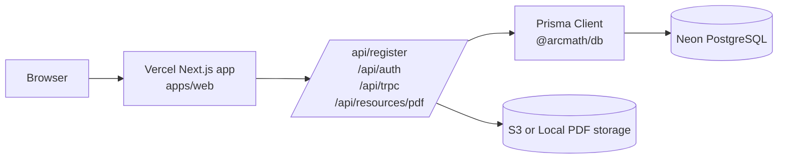

# ArcMath Architecture

## 1. System overview
ArcMath is a pnpm monorepo centered on a Next.js 16 App Router web application.

Core runtime pieces:
- `apps/web`: UI + server-side route handlers + tRPC API + NextAuth.
- `packages/db`: Prisma schema/migrations/client bootstrap for PostgreSQL.
- `packages/shared`: shared domain schemas (Zod), RBAC helpers, common types.
- `packages/ingest-aops`: ingestion/utility package for contest data import workflows (non-request-path).

External dependencies:
- Neon PostgreSQL (system of record).
- Vercel serverless runtime (Node.js) for app and API.
- Optional object storage for PDFs (`local` or `s3`, production recommends `s3`).

There is no custom Express/Node server; Next.js route handlers handle HTTP server logic.

## 2. Folder structure

```text
.
├── apps/
│   └── web/
│       ├── src/app/                 # App Router pages + route handlers
│       ├── src/lib/                 # auth, trpc, resource logic, storage adapters
│       ├── src/components/          # UI components
│       ├── src/scripts/             # operational scripts
│       └── next.config.ts           # monorepo/prisma bundling config
├── packages/
│   ├── db/
│   │   ├── prisma/schema.prisma     # Prisma schema
│   │   ├── prisma/migrations/       # SQL migrations
│   │   └── src/client.ts            # PrismaClient singleton
│   ├── shared/                      # shared schemas/types/rbac
│   └── ingest-aops/                 # ingestion tooling
├── scripts/                         # production preflight + data materialization helpers
├── DEPLOYMENT.md                    # Vercel + Neon deployment guide
└── docker-compose.yml               # local postgres service
```

## 3. Database schema explanation
Datasource/provider:
- Prisma datasource: `postgresql` (`DATABASE_URL`).

Key enums:
- `Role`: `STUDENT | TEACHER | ADMIN`
- `Contest`: `AMC8 | AMC10 | AMC12 | AIME`
- `ProblemSetStatus`, `StatementFormat`, `AnswerFormat`

Main models and relationships:
- `User`
  - auth identity (`email`, `passwordHash`, `role`)
  - relations: `Enrollment[]`, `ImportJob[]`, `UserResourceAccess[]`
- `Class`
  - class container
  - relation: `Enrollment[]`
- `Enrollment`
  - join table for user-class membership with role
  - unique: `(userId, classId)`
- `ProblemSet`
  - contest/year/exam paper metadata
  - includes PDF cache metadata (`cachedPdfPath`, sha/size/status fields)
  - relations: `Problem[]`, `UserResourceAccess[]`
  - unique: `(contest, year, exam)`
- `Problem`
  - individual problem rows linked to a `ProblemSet`
  - unique: `(problemSetId, number)`
- `UserResourceAccess`
  - tracks free-tier consumption per user per problem set
  - unique: `(userId, problemSetId)`
- `ImportJob`
  - import pipeline execution metadata and report JSON

Overall: schema mixes auth/account data, learning content (`ProblemSet`/`Problem`), and download-governance (`UserResourceAccess`).

## 4. Auth flow
Authentication stack:
- NextAuth (`/api/auth/[...nextauth]`) with Credentials provider only.
- Session strategy: JWT.
- Password verification: `bcrypt.compare(withPepper(password), passwordHash)`.

Authorization stack:
- Route protection via `src/middleware.ts` for protected prefixes (`/dashboard`, `/resources`, `/admin`, etc.).
- Admin gate: role check using shared RBAC helper `canAccessAdmin`.
- tRPC also enforces auth/admin via middlewares (`protectedProcedure`, `adminProcedure`).

Registration:
- `POST /api/register` validates payload with shared Zod schema.
- Creates user in DB with default role `STUDENT`.

## 5. API routes
Route Handlers:
- `POST /api/register`
  - create account (`User`) after schema validation and duplicate check.
- `GET|POST /api/auth/[...nextauth]`
  - NextAuth session and credentials login endpoint.
- `GET /api/resources/pdf`
  - authenticated PDF download endpoint (membership/limit aware).
- `GET|POST /api/trpc/[trpc]`
  - single tRPC transport endpoint.

Main tRPC namespaces:
- `healthcheck`, `currentUser`
- `resources`, `resourceSets` (search/filter/access gating)
- `admin.import`, `admin.resourceAccess`

## 6. Deployment architecture (Vercel + Neon)



Deployment characteristics:
- Vercel project root: `apps/web`.
- Monorepo packages are transpiled (`@arcmath/db`, `@arcmath/shared`).
- Prisma client is generated from `packages/db/prisma/schema.prisma`.
- `next.config.ts` explicitly includes Prisma artifacts in file tracing to avoid runtime engine-missing issues in serverless.
- Neon is primary production DB; `DATABASE_URL` must include SSL.

## 7. Data flow for user registration
1. User submits form on `/register`.
2. Frontend sends `POST /api/register` with `{ email, name?, password }`.
3. API validates with shared `registerSchema`.
4. API normalizes email and checks uniqueness (`prisma.user.findUnique`).
5. Password is hardened with pepper + bcrypt hash.
6. API inserts new `User` with role `STUDENT`.
7. API returns `201` + minimal user payload.
8. UI redirects user to `/login`.

## 8. Data flow for resource access
### A. Resource discovery and lock decision
1. `/resources` page calls `trpc.resourceSets.listDistinctFilters` and `trpc.resources.byKey`.
2. Server queries scoped downloadable sets (`listScopedDownloadableProblemSets`).
3. Membership state is computed from session role (`ADMIN` treated as active membership).
4. Free-limit status is checked via `UserResourceAccess` tracking.
5. Response returns either:
   - `status: "ok"` + file metadata, or
   - `status: "locked"` + usage message.

### B. PDF download
1. UI builds URL `/api/resources/pdf?id=<problemSetId>&variant=<problems|answers>`.
2. Route checks session (`401` if unauthenticated).
3. `getResourcePdfResponse` loads `ProblemSet` and consumes/checks access quota.
4. It tries cached storage first (`local` file response or `s3` presigned redirect).
5. If cache miss, system generates PDF, stores cache metadata/object, then returns PDF response.
6. If free quota exceeded and no membership, returns `403` lock response.

## 9. Suggested improvements
1. Remove insecure auth secret fallback in production paths.
2. Replace deprecated `middleware` convention with `proxy` (Next.js warning already present).
3. Introduce explicit membership/billing table instead of role-based placeholder logic.
4. Add rate limiting + abuse controls for `/api/register` and credential login.
5. Replace `any`-typed Prisma parameters in resource access modules with strict Prisma types.
6. Add OpenTelemetry/request correlation for API + tRPC + Prisma queries.
7. Move heavy PDF generation to background jobs/queue for better latency and retry control.
8. Add architecture decision records (ADR) for storage driver strategy and access-limit policy.
9. Add stronger integration tests for end-to-end registration and resource download flows on preview deployments.
